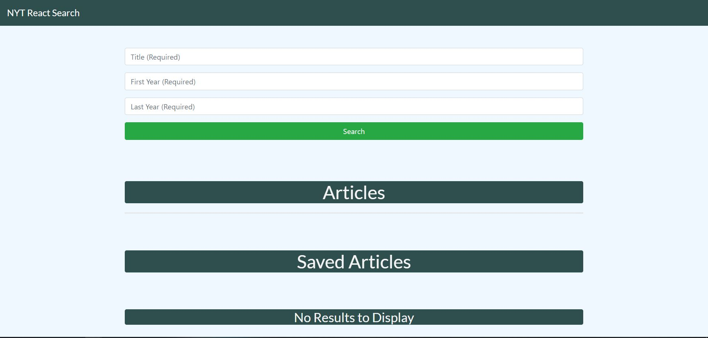
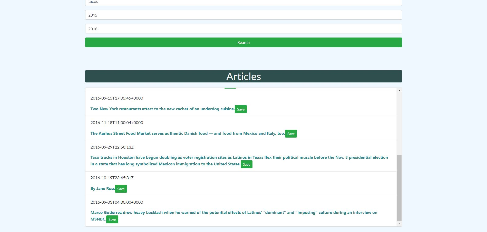

# NYT React Search

https://immense-earth-26245.herokuapp.com/

# Overview

This New York Times React Search page was built as a full-stack application. It utilizes Mongo, Express, React, and Node as well as axios for the API calls. 

What it does: This app allows users to search through the NYT api for a topic and through a years. ALl three fields are required for a succesfull query. The articles are renderd to the page and are allowed to be save. Upon saving, the Title, Published Date, and URL are added to the Mongo database and are rendered in the Saved section of the page. Saved articles can also be delete which triggers a call to the database to delete the article. 

Landing Page

Searching

Delete

